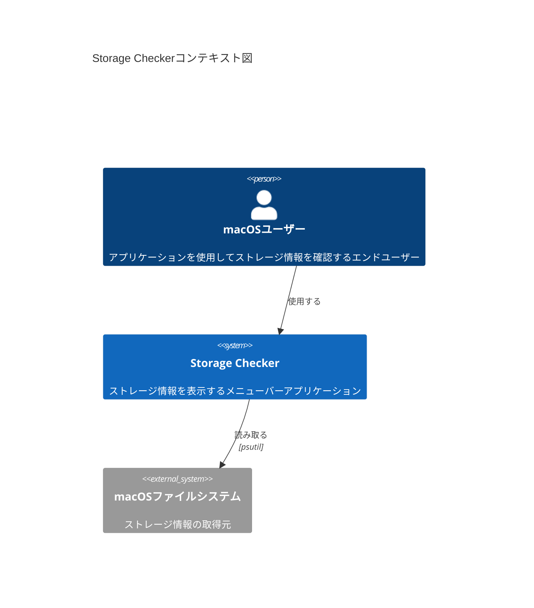
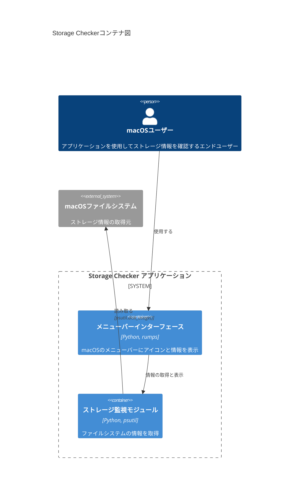
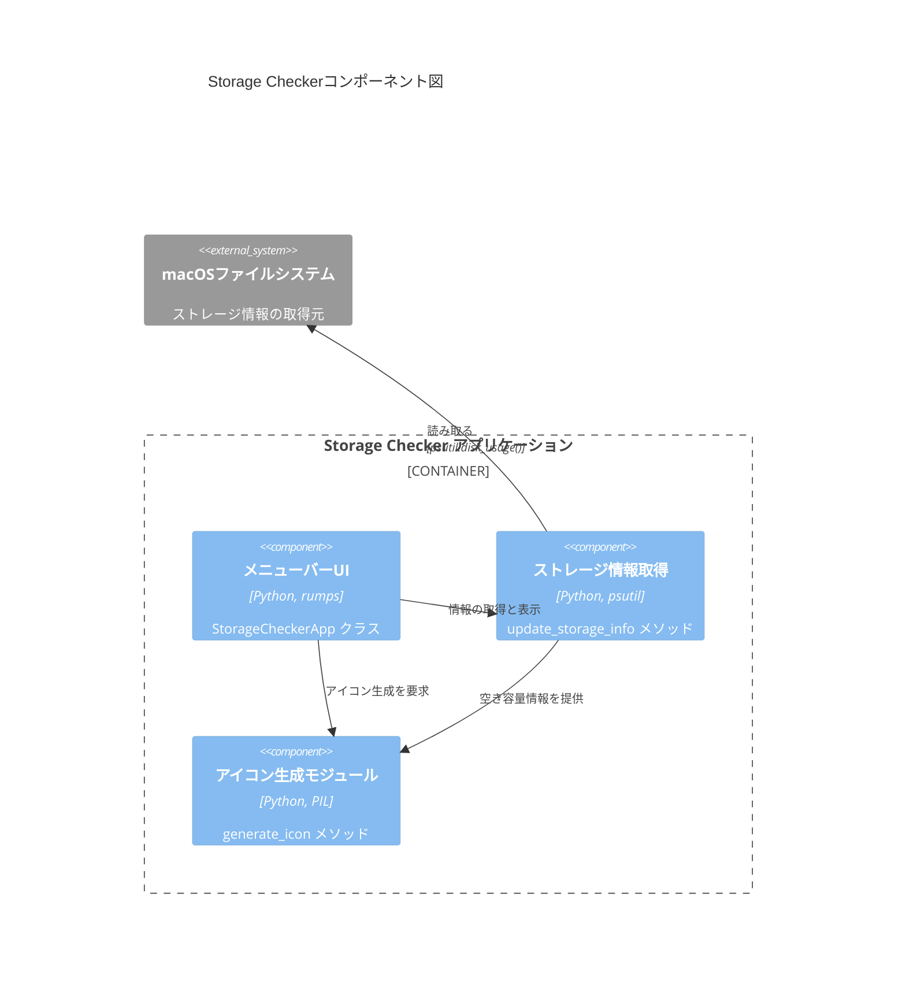
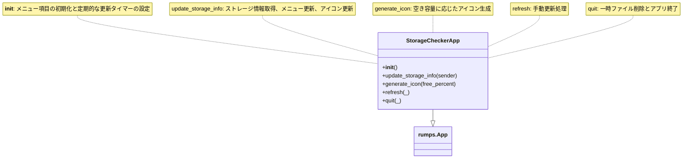

# アーキテクチャ

このドキュメントでは、C4モデルに基づいてStorage Checkerアプリケーションのアーキテクチャを説明します。

## レベル1: コンテキスト図

**説明**:

- **macOSユーザー**: アプリケーションを使用してストレージ情報を確認するエンドユーザー
- **Storage Checker**: ストレージ情報を表示するメニューバーアプリケーション
- **macOSファイルシステム**: ストレージ情報の取得元

## レベル2: コンテナ図

**説明**:

- **メニューバーインターフェース**: rumpsライブラリを使用してmacOSのメニューバーにアイコンと情報を表示
- **ストレージ監視モジュール**: psutilライブラリを使用してファイルシステムの情報を取得

## レベル3: コンポーネント図

**説明**:

- **メニューバーUI (StorageCheckerApp)**: rumpsを使用したメニューバーアプリケーションのメインクラス
- **ストレージ情報取得 (update_storage_info)**: psutilを使用してストレージ情報を取得するメソッド
- **アイコン生成モジュール (generate_icon)**: PILを使用して空き容量に応じたアイコンを動的に生成するメソッド

## レベル4: コード図

主要なクラスとメソッドの関係:

**主要なデータフロー**:

1. アプリケーション起動時に`__init__`が実行され、初期設定と定期更新タイマーが設定される
2. `update_storage_info`メソッドが呼び出され、ストレージ情報を取得
3. 取得した情報に基づいて`generate_icon`メソッドがアイコンを生成
4. メニューバーのアイコンとメニュー項目が更新される
5. 以降、タイマーまたは手動更新によって2〜4のプロセスが繰り返される 